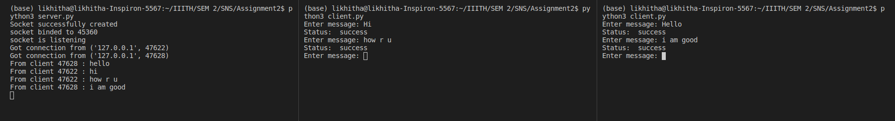

# Commands

- To execute server program:

       > python3 server.py

- To execute client program:

        > python3 client.py

- The key used here is : 1010
- And the matrix is :

        > [[-3, -3, -4], [0, 1, 1], [4, 3, 4]]

- Several clients can communicate with server
- Server displays the client message
- Server can uniquely identify the client by the port number
- This project can only display the messages in lower case
- Input can be given in lower case or upper case
- After sending the message to server. Client will receive a success message
- If the CRC is not matched then an error message is displayed both on receiver side and sender side

# Working

#### Client side

- First the client will connect to server
- It will take input from the user
- If the input length is not a multiple of 3 append spaces to it
- After this map the values for each alphabet to a number from the given mapping in assigment
- Convert the above sequence to 3xZ matrix
- Multiply this matrix with A matrix which is 3x3 (mentioned above)
- Calculate crc for the message (get_crc() method in client.py)
- Send the encrypted matrix and CRC to the server

#### Server side

- Accept connection from client
- Each client is executed seperatly within a thread
- Get the encrypted matrix and the crc
- Decrypted the matrix by multiplying A_inverse(mentioned above)
- Get the message from the decrypted matrix using the mapping provided
- Calculate CRC for this message
- Compare the CRC sent by the client
- If matched then send a success message, else print CRC not matched on console

